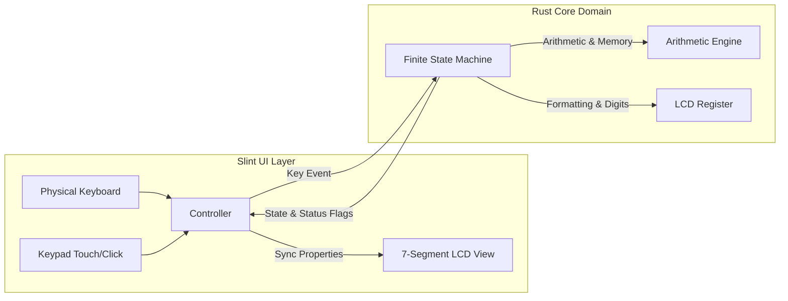

# Heptaseg Architecture & Technical Specification

This document describes the architectural philosophy, design patterns, and state machine transitions powering the **Heptaseg** pocket calculator.

---

## 1. Architectural Philosophy: Decoupled MVI / FSM

Heptaseg strictly separates the **visual representation layer** from the **domain arithmetic and state transitions**:

1. **Zero UI Dependencies in Core Logic**: The entire `src/core/` module is completely independent of Slint or any GUI library. It can be compiled in headless environments, embedded devices (`no_std` with minor adaptations), or tested in unit tests with zero graphical overhead.
2. **Unidirectional Data Flow**:
   - The user interacts with the UI (mouse clicks or physical keyboard strokes).
   - The UI/Controller encodes the input into a strongly-typed `Key` event.
   - The `CalculatorFsm` processes the event and produces a deterministic state transition.
   - The UI reads the updated state properties (`display_string`, `status_flags`) and repaints the screen.



---

## 2. Design Patterns

### 2.1 State Pattern (Functional FSM)
The calculator state is modeled as an algebraic data type (`enum CalculatorState`), making invalid states unrepresentable in the type system:

```rust
pub enum CalculatorState {
    Ready,
    EnteringOperand1 { register: Register },
    OperatorPending { accumulator: f64, operator: BinaryOp },
    EnteringOperand2 { accumulator: f64, operator: BinaryOp, register: Register },
    ResultDisplayed { register: Register, last_operation: Option<(BinaryOp, f64)> },
    Error,
}
```

### 2.2 Command / Event Pattern
All interactions enter the system through a unified `Key` enum:
- `Key::Digit(u8)`: Input digits `0` through `9`.
- `Key::DecimalPoint`: Input `.`.
- `Key::BinaryOp(BinaryOp)`: Operations `+`, `−`, `×`, `÷`.
- `Key::UnaryOp(UnaryOp)`: Immediate operations `√`, `%`, `±`.
- `Key::MemoryOp(MemoryOp)`: Memory operations `M+`, `M−`, `MR`, `MC`.
- `Key::Equals`: Execution `=`.
- `Key::Clear`: All Clear (`AC`).
- `Key::ClearEntry`: Clear Entry (`CE`).

### 2.3 Domain Error Handling
Instead of returning opaque unit types `()`, errors are formally typed as `CalculatorError`:
- `DivisionByZero`: Division by `0`.
- `NegativeSquareRoot`: Square root of a negative operand.
- `Overflow`: Results exceeding the 8-digit LCD capacity ($\ge 10^8$ or $\le -10^8$).
- `InvalidInput`: Malformed numeric strings.

---

## 3. Finite State Machine Transitions

| Current State | Event / Key | Next State | Action / Effect |
| :--- | :--- | :--- | :--- |
| **`Ready`** | `Digit(d)` | `EnteringOperand1` | Register initialized to `d`. |
| **`Ready`** | `DecimalPoint` | `EnteringOperand1` | Register initialized to `0.`. |
| **`Ready`** | `BinaryOp(op)` | `OperatorPending` | Accumulator set to `0.0`, pending operator set. |
| **`EnteringOperand1`** | `Digit(d)` | `EnteringOperand1` | Append digit (up to 8 digits max). |
| **`EnteringOperand1`** | `BinaryOp(op)` | `OperatorPending` | Accumulator set to operand 1 value. |
| **`EnteringOperand1`** | `UnaryOp(op)` | `ResultDisplayed` | Apply unary operation to operand 1. |
| **`EnteringOperand1`** | `ClearEntry` | `Ready` | Clear operand 1 back to 0. |
| **`OperatorPending`** | `BinaryOp(new_op)` | `OperatorPending` | Replace pending operator with `new_op`. |
| **`OperatorPending`** | `Digit(d)` | `EnteringOperand2` | Operand 2 initialized to `d`. |
| **`OperatorPending`** | `Equals` | `ResultDisplayed` | Computes `accumulator <op> accumulator`. |
| **`EnteringOperand2`** | `Digit(d)` | `EnteringOperand2` | Append digit to operand 2. |
| **`EnteringOperand2`** | `BinaryOp(new_op)` | `OperatorPending` | Evaluate intermediate result (chaining) $\to$ accumulator. |
| **`EnteringOperand2`** | `Equals` | `ResultDisplayed` | Evaluate operation $\to$ display; save last operation for repeat. |
| **`EnteringOperand2`** | `ClearEntry` | `OperatorPending` | Clear operand 2, keep accumulator & operator. |
| **`ResultDisplayed`** | `Digit(d)` | `EnteringOperand1` | Start fresh calculation with `d`. |
| **`ResultDisplayed`** | `BinaryOp(op)` | `OperatorPending` | Use displayed result as operand 1. |
| **`ResultDisplayed`** | `Equals` | `ResultDisplayed` | Repeat last operation (e.g. `+ 3`). |
| **`Error`** | `Clear (AC)` | `Ready` | Clear error flag and reset to 0. |
| **Any State** | `Clear (AC)` | `Ready` | Reset state machine (preserves memory register). |
| **Any State** | `MemoryOp(Add/Sub)`| *Unchanged* | Add/sub displayed value to memory register. |
| **Any State** | `MemoryOp(Clear)` | *Unchanged* | Clear memory register to `0.0`. |
| **Any State** | `MemoryOp(Recall)`| `ResultDisplayed` | Load memory value into display register. |

---

## 4. LCD Vector Rendering Strategy

Instead of bundling or relying on external font files which may render inconsistently across platforms (Linux FreeType vs. Windows DirectWrite vs. macOS CoreText), **Heptaseg renders each 7-segment digit cell using declarative vector polygons**:

```
         ─ A ─
       │       │
       F       B
       │       │
         ─ G ─
       │       │
       E       C
       │       │
         ─ D ─    (• DP)
```

Each segment $S \in \{A, B, C, D, E, F, G, DP\}$ is evaluated dynamically:
- **Active state**: Rendered in dark liquid-crystal charcoal (`#141c11`).
- **Inactive/Ghost state**: Rendered in faint greenish-grey (`#788866`) against the vintage LCD background (`#899975`).

This achieves the true visual effect of real physical LCD segments illuminated by ambient light.
