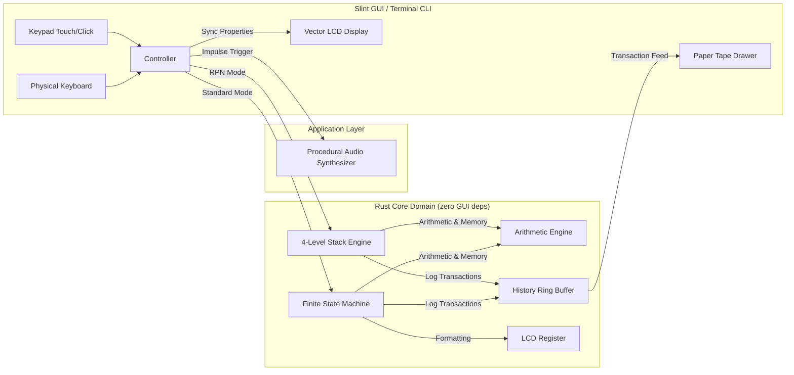

# Heptaseg Architecture & Technical Specification

This document describes the architectural philosophy, design patterns, calculation engines, and state machine transitions powering **Heptaseg**.

---

## 1. Architectural Philosophy: Decoupled MVI / FSM

Heptaseg strictly separates the **visual representation layer** from the **domain arithmetic, stack logic, and state transitions**:

1. **Zero UI Dependencies in Core Logic**: The entire `src/core/` module is completely independent of Slint or any GUI framework. It compiles in headless environments, terminal CLIs, or embedded devices with zero graphical overhead.
2. **Unidirectional Data Flow**:
   - The user interacts with the UI (mouse clicks, touch events, or physical keyboard strokes).
   - The Controller layer encodes the input into a strongly-typed `Key` event and plays tactile procedural click audio.
   - The active engine (`CalculatorFsm` or `RpnCalculator`) processes the event and executes deterministic transitions.
   - The UI reads updated state properties (`display_string`, `status_flags`, `history`) and reactively repaints the screen and paper tape.



---

## 2. Calculation Engines

### 2.1 Standard Pocket Calculator (Immediate Execution FSM)
The standard calculator state is modeled as an algebraic data type (`enum CalculatorState`), making invalid states unrepresentable in the type system:

```rust
pub enum CalculatorState {
    Ready,
    EnteringOperand1 { register: Register },
    OperatorPending { accumulator: f64, operator: BinaryOp },
    EnteringOperand2 { accumulator: f64, operator: BinaryOp, register: Register },
    ResultDisplayed { register: Register, last_operation: Option<(BinaryOp, f64)> },
    Error,
}
```

### 2.2 HP-Style RPN Mode (4-Level Operational Stack)
In RPN mode, operands are pushed onto an operational stack before operators are evaluated:

```rust
pub struct RpnStack {
    pub x: f64, // Bottom of stack (currently active on display)
    pub y: f64, // Level 2
    pub z: f64, // Level 3
    pub t: f64, // Top of stack (replicated on pop)
}
```

- **`Enter`**: Lifts the stack: `T <- Z`, `Z <- Y`, `Y <- X`, `X <- val`.
- **Binary Operator**: Evaluates `Y <op> X`, drops stack: `X <- res`, `Y <- Z`, `Z <- T`.
- **`Drop` / `Swap`**: Stack manipulation primitives for scientific calculations.

---

## 3. Paper Tape Transaction Audit Engine

Every completed calculation produces an immutable `HistoryEntry` recorded in an append-only ring buffer:

```rust
pub struct HistoryEntry {
    pub id: usize,
    pub expression: String, // e.g. "120 + 35 =" or "144 √ ="
    pub result: String,     // e.g. "155"
}
```

The paper tape roll is synchronized reactively to the Slint GUI and can be inspected in the terminal CLI with `tape`.

---

## 4. Procedural Tactile Audio Feedback

Rather than bundling bulky external WAV/MP3 files, key clicks are synthesized procedurally in memory:
- **Sample Rate**: 44,100 Hz PCM.
- **Duration**: ~15 ms (661 samples).
- **Acoustic Profile**: An exponential decay envelope combining a high-frequency switch transient ($2400\text{ Hz}$) with a mechanical resonant thud ($750\text{ Hz}$):
  $$s(t) = e^{-t / 0.0035} \cdot \left(0.6 \sin(2\pi \cdot 2400 \cdot t) + 0.4 \sin(2\pi \cdot 750 \cdot t)\right)$$
- Gracefully handles headless environments by silencing if no audio device is present.

---

## 5. Retro Display Themes

The vector LCD rendering engine supports four vintage hardware presets:

| Theme | Panel Background | Active Ink | Inactive/Ghost Ink | Description |
| :--- | :--- | :--- | :--- | :--- |
| **Classic Olive LCD** | `#899975` | `#141c11` | `#788866` | Standard 1980s pocket calculator. |
| **Quartz Silver LCD** | `#9ea7a6` | `#0c1012` | `#8a9392` | High-contrast modern quartz panel. |
| **VFD Cyan** | `#061113` | `#00f5d4` | `#042926` | 1970s Vacuum Fluorescent Display. |
| **Sinclair Ruby LED** | `#140305` | `#ff1a2a` | `#3d070b` | Vintage red LED display aesthetic. |

---

## 6. Standard FSM State Transitions

| Current State | Event / Key | Next State | Action / Effect |
| :--- | :--- | :--- | :--- |
| **`Ready`** | `Digit(d)` | `EnteringOperand1` | Register initialized to `d`. |
| **`Ready`** | `DecimalPoint` | `EnteringOperand1` | Register initialized to `0.`. |
| **`Ready`** | `BinaryOp(op)` | `OperatorPending` | Accumulator set to `0.0`, pending operator set. |
| **`EnteringOperand1`** | `Digit(d)` | `EnteringOperand1` | Append digit (up to 8 digits max). |
| **`EnteringOperand1`** | `BinaryOp(op)` | `OperatorPending` | Accumulator set to operand 1 value. |
| **`EnteringOperand1`** | `UnaryOp(op)` | `ResultDisplayed` | Apply unary operation to operand 1; log to Tape. |
| **`EnteringOperand1`** | `ClearEntry` | `Ready` | Clear operand 1 back to 0. |
| **`OperatorPending`** | `BinaryOp(new_op)` | `OperatorPending` | Replace pending operator with `new_op`. |
| **`OperatorPending`** | `Digit(d)` | `EnteringOperand2` | Operand 2 initialized to `d`. |
| **`OperatorPending`** | `Equals` | `ResultDisplayed` | Computes `accumulator <op> accumulator`; log to Tape. |
| **`EnteringOperand2`** | `Digit(d)` | `EnteringOperand2` | Append digit to operand 2. |
| **`EnteringOperand2`** | `BinaryOp(new_op)` | `OperatorPending` | Evaluate intermediate result (chaining); log to Tape. |
| **`EnteringOperand2`** | `Equals` | `ResultDisplayed` | Evaluate operation; save last operation for repeat; log to Tape. |
| **`EnteringOperand2`** | `ClearEntry` | `OperatorPending` | Clear operand 2, keep accumulator & operator. |
| **`ResultDisplayed`** | `Digit(d)` | `EnteringOperand1` | Start fresh calculation with `d`. |
| **`ResultDisplayed`** | `BinaryOp(op)` | `OperatorPending` | Use displayed result as operand 1. |
| **`ResultDisplayed`** | `Equals` | `ResultDisplayed` | Repeat last operation (e.g. `+ 3`); log to Tape. |
| **`Error`** | `Clear (AC)` | `Ready` | Clear error flag and reset to 0. |
| **Any State** | `Clear (AC)` | `Ready` | Reset state machine (preserves memory and tape). |
| **Any State** | `MemoryOp(Add/Sub)`| *Unchanged* | Add/sub displayed value to memory register. |
| **Any State** | `MemoryOp(Clear)` | *Unchanged* | Clear memory register to `0.0`. |
| **Any State** | `MemoryOp(Recall)`| `ResultDisplayed` | Load memory value into display register. |
