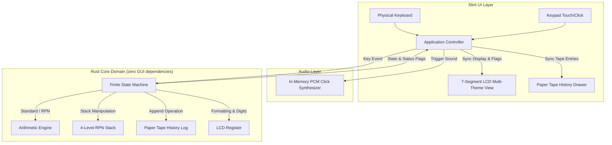

# Heptaseg Architecture & Technical Specification

This document describes the architectural philosophy, design patterns, and state machine transitions powering the **Heptaseg** pocket calculator.

---

## 1. Architectural Philosophy: Decoupled MVI / FSM

Heptaseg strictly separates the **visual representation layer** from the **domain arithmetic and state transitions**:

1. **Zero UI Dependencies in Core Logic**: The entire `src/core/` module is completely independent of Slint or any GUI library. It can be compiled in headless environments, embedded devices (`no_std` with minor adaptations), or tested in unit tests with zero graphical overhead.
2. **Unidirectional Data Flow**:
   - The user interacts with the UI (mouse clicks, touch, or physical keyboard strokes).
   - The UI/Controller encodes the input into a strongly-typed `Key` event.
   - The `CalculatorFsm` processes the event and produces a deterministic state transition.
   - The UI reads the updated state properties (`display_string`, `status_flags`, `history`) and repaints the screen.



---

## 2. Design Patterns

### 2.1 State Pattern (Functional FSM)
The standard calculator state is modeled as an algebraic data type (`enum CalculatorState`), making invalid states unrepresentable in the type system:

```rust
pub enum CalculatorState {
    Ready,
    EnteringOperand1 { register: Register },
    OperatorPending { accumulator: f64, operator: BinaryOp },
    EnteringOperand2 { accumulator: f64, operator: BinaryOp, register: Register },
    ResultDisplayed { register: Register, last_operation: Option<(BinaryOp, f64)> },
    Error,
}
```

### 2.2 Dual Calculation Engine: Standard vs. RPN
The calculator can operate in two distinct modes:
1. **Standard Pocket Mode**: Immediate sequential execution (`2 + 3 × 4 = 20`) with repeat calculation on consecutive `=` presses.
2. **HP-Style 4-Register RPN Stack**: Classical 4-level operational stack ($X, Y, Z, T$) with stack drop, roll-down, and binary operators consuming $Y$ and $X$.

```rust
pub struct RpnStack {
    pub x: f64, // Bottom of stack (display register)
    pub y: f64, // Second operand
    pub z: f64, // Third operand
    pub t: f64, // Top of stack
}
```

### 2.3 Paper Tape Ring Buffer History Log
Calculations and intermediate expressions are logged to a ring buffer (`HistoryLog`):
- Records timestamp, operands, operator, and final result.
- Provides receipt paper formatting (`format_paper_tape()`).
- Automatically updates in both GUI and CLI frontends.

### 2.4 In-Memory Tactile Audio Synthesis
Key presses trigger a procedural in-memory mechanical click synthesizer (`src/audio.rs`):
- Zero external audio assets or static `.wav` files required.
- Generates 9ms damped PCM impulse waveforms ($1100\text{Hz} \to 280\text{Hz}$ bottom-out drop + exponential decay).
- Non-blocking playback via `rodio` with mute toggle.

---

## 3. Finite State Machine Transitions (Standard Mode)

| Current State | Event / Key | Next State | Action / Effect |
| :--- | :--- | :--- | :--- |
| **`Ready`** | `Digit(d)` | `EnteringOperand1` | Register initialized to `d`. |
| **`Ready`** | `DecimalPoint` | `EnteringOperand1` | Register initialized to `0.`. |
| **`Ready`** | `BinaryOp(op)` | `OperatorPending` | Accumulator set to `0.0`, pending operator set. |
| **`EnteringOperand1`** | `Digit(d)` | `EnteringOperand1` | Append digit (up to 8 digits max). |
| **`EnteringOperand1`** | `BinaryOp(op)` | `OperatorPending` | Accumulator set to operand 1 value. |
| **`EnteringOperand1`** | `UnaryOp(op)` | `ResultDisplayed` | Apply unary operation to operand 1. |
| **`EnteringOperand1`** | `ClearEntry` | `Ready` | Clear operand 1 back to 0. |
| **`OperatorPending`** | `BinaryOp(new_op)` | `OperatorPending` | Replace pending operator with `new_op`. |
| **`OperatorPending`** | `Digit(d)` | `EnteringOperand2` | Operand 2 initialized to `d`. |
| **`OperatorPending`** | `Equals` | `ResultDisplayed` | Computes `accumulator <op> accumulator`. |
| **`EnteringOperand2`** | `Digit(d)` | `EnteringOperand2` | Append digit to operand 2. |
| **`EnteringOperand2`** | `BinaryOp(new_op)` | `OperatorPending` | Evaluate intermediate result (chaining) $\to$ accumulator. |
| **`EnteringOperand2`** | `Equals` | `ResultDisplayed` | Evaluate operation $\to$ display; save last operation for repeat. |
| **`EnteringOperand2`** | `ClearEntry` | `OperatorPending` | Clear operand 2, keep accumulator & operator. |
| **`ResultDisplayed`** | `Digit(d)` | `EnteringOperand1` | Start fresh calculation with `d`. |
| **`ResultDisplayed`** | `BinaryOp(op)` | `OperatorPending` | Use displayed result as operand 1. |
| **`ResultDisplayed`** | `Equals` | `ResultDisplayed` | Repeat last operation (e.g. `+ 3`). |
| **`Error`** | `Clear (AC)` | `Ready` | Clear error flag and reset to 0. |
| **Any State** | `Clear (AC)` | `Ready` | Reset state machine (preserves memory register). |
| **Any State** | `MemoryOp(Add/Sub)`| *Unchanged* | Add/sub displayed value to memory register. |
| **Any State** | `MemoryOp(Clear)` | *Unchanged* | Clear memory register to `0.0`. |
| **Any State** | `MemoryOp(Recall)`| `ResultDisplayed` | Load memory value into display register. |

---

## 4. Retro Display Palette Specifications

| Theme | Display Technology | Background | Active Segment | Inactive (Ghost) |
| :--- | :--- | :--- | :--- | :--- |
| **Classic LCD** | Vintage Olive Liquid Crystal | `#899975` | `#141c11` (Charcoal) | `#788866` (Ghost Olive) |
| **Quartz LCD** | Silver-Grey Quartz Glass | `#9ea7a6` | `#0c1012` (Black) | `#87908f` (Ghost Grey) |
| **VFD Cyan** | Vacuum Fluorescent Tube | `#081014` | `#00f5d4` (Radiant Cyan) | `#003832` (Dark Teal) |
| **Ruby LED** | 1976 Sinclair Sovereign LED | `#180406` | `#ff1e2e` (Bright Red) | `#3d070b` (Ruby Ghost) |
