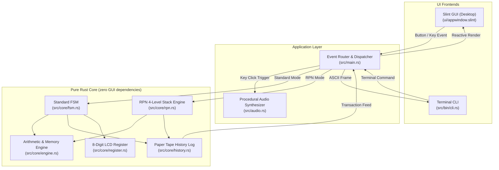

# Heptaseg 📟

[](https://github.com/vikman90/heptaseg/actions/workflows/ci.yml)
[](https://github.com/vikman90/heptaseg/releases)
[](https://opensource.org/licenses/MIT)
[](https://www.rust-lang.org/)
[](https://slint.dev/)

<p align="center">
  
</p>

**Heptaseg** (*hepta* [seven] + *seg* [segments]) is a vintage 8-digit pocket calculator application engineered in **Rust** and rendered with **Slint**. 

It is designed as a study in **clean software architecture, deterministic Finite State Machines (FSM), and vector liquid crystal display (LCD) synthesis**. The core domain is 100% decoupled from the user interface, allowing the same calculation engines to power both the native graphical desktop app and a retro terminal CLI.

---

## ✨ Features

- **Authentic Retro Display Engine with 4 Themes**:
  - **Classic Olive LCD**: Iconic 1980s olive green background with liquid crystal charcoal ink.
  - **Quartz Silver LCD**: Modernized high-contrast silver-grey panel with deep black ink.
  - **VFD (Vacuum Fluorescent Display)**: Dark teal panel with glowing electric cyan-turquoise segments.
  - **Sinclair Ruby LED**: 1970s vintage calculator aesthetic with glowing red LED segments.
  - Pixel-perfect orthogonal vector polygons with realistic inactive/ghost segment coloring under ambient contrast.
  - Annunciator indicators: Memory Active (`M`), Negative Sign (`−`), Error/Overflow (`E`), and active pending operator (`+`, `−`, `×`, `÷`).
- **📜 Expandable Paper Tape Audit Roll**:
  - Pull-out vintage thermal paper receipt drawer recording every calculation with transaction indices, expressions, and formatted results.
  - Monospace accounting ledger typography and one-click "Clear Tape" action.
- **🔊 Procedural Tactile Audio Feedback**:
  - In-memory procedural synthesis of a crisp 15ms mechanical key switch impulse (zero external audio file dependencies).
  - Sound toggle button (`SND` / `MUTE`) directly in the header.
- **🧮 Dual Calculation Modes (Standard & RPN)**:
  - **Standard Mode (Pocket Calculator)**: Immediate execution chaining (`2 + 3 × 4 = 20`), operator replacement, and repeat equals.
  - **RPN Mode (HP-Style Reverse Polish Notation)**: Classic 4-level operational stack (`X`, `Y`, `Z`, `T`) with automatic stack lift, `Enter`, `Drop`, and `Swap`.
- **Dual Frontends (GUI & CLI)**:
  - **Desktop GUI**: Native Slint application compiling to a single lightweight binary on **Linux**, **macOS**, and **Windows** (~15 MB RAM).
  - **Terminal CLI**: Terminal interface rendering an ASCII 7-segment LCD directly in stdout (`cargo run --bin cli`).
- **Formal Verification & Property-Based Testing**:
  - Mathematical invariants validated over thousands of randomized keystroke sequences using `proptest`.
- **Automated Multi-Platform Release Assets**:
  - GitHub Actions workflow automatically compiles and packages standalone release archives (`.tar.gz` for Linux, `.zip` for Windows and macOS) with SHA256 checksums on tag push.

---

## ⌨️ Keyboard Shortcuts (Desktop GUI)

| Key | Calculator Action | Description |
| :--- | :--- | :--- |
| `0` – `9` | Digits `0`–`9` | Enter numerical digits |
| `.` or `,` | Decimal Point `•` | Append decimal separator |
| `+`, `-`, `*`, `/` | Operations `+`, `−`, `×`, `÷` | Set or chain binary operator |
| `Enter` or `=` | Equals / RPN Enter | Evaluate calculation / push onto RPN stack |
| `%` | Percentage `%` | Compute percentage |
| `Escape` or `c` / `C` | All Clear `AC` | Reset state machine and display |
| `Backspace` or `Delete` | Clear Entry `CE` | Clear currently typed number |
| `t` or `T` | Toggle Paper Tape | Open or close the calculation history roll |

---

## 🏗️ Architecture Overview

Heptaseg follows a unidirectional, decoupled **Model-View-Update (MVI)** design:



For deeper architectural details, state transition tables, and design patterns, see [`ARCHITECTURE.md`](ARCHITECTURE.md).

---

## 🚀 Building and Running

### Prerequisites
- **Rust toolchain** (1.70 or newer recommended): [rustup.rs](https://rustup.rs/)

### Run Graphical Desktop Application
```bash
cargo run --release
```

### Run Terminal CLI Mode
```bash
# Standard mode
cargo run --bin cli

# RPN mode
cargo run --bin cli -- --rpn
```

### Run Comprehensive Test Suite
```bash
# Runs all 18 unit tests, 15 FSM integration tests, 2 RPN tests, and proptest suites
cargo test --all-targets
```

### Run Linter & Formatter Checks
```bash
cargo clippy --all-targets -- -D warnings
cargo fmt --check
```

---

## 📁 Repository Structure

```
heptaseg/
├── .github/
│   └── workflows/
│       ├── ci.yml           # Multi-platform CI (Linux, macOS, Windows)
│       └── release.yml      # Automated release binary packaging & upload
├── Cargo.toml               # Package configuration & dependencies
├── build.rs                 # Slint template build compilation
├── LICENSE                  # MIT License
├── README.md                # Project documentation
├── ARCHITECTURE.md          # In-depth architectural specification
├── ui/
│   ├── appwindow.slint      # Main calculator casing, header, and themes
│   ├── paper_tape.slint     # Expandable retro paper tape audit roll
│   ├── lcd_display.slint    # 8-digit LCD bezel, grid & annunciators
│   ├── lcd_digit.slint      # Vector-rendered 7-segment + DP digit cell
│   └── keypad.slint         # Tactile 3D beveled buttons and keypad grid
├── src/
│   ├── main.rs              # Desktop GUI entry point & Slint synchronization
│   ├── audio.rs             # Procedural mechanical key click sound synthesizer
│   ├── lib.rs               # Library root re-exporting core modules
│   ├── bin/
│   │   └── cli.rs           # Terminal CLI binary with ASCII 7-segment display
│   └── core/
│       ├── mod.rs           # Core module definitions
│       ├── types.rs         # Domain types (Key, BinaryOp, UnaryOp, MemoryOp, Flags)
│       ├── register.rs      # 8-digit numeric buffer & LCD formatting
│       ├── engine.rs        # Arithmetic calculations & memory bank
│       ├── history.rs       # Paper Tape audit transaction ring buffer
│       ├── rpn.rs           # HP-style 4-level operational stack RPN engine
│       ├── state.rs         # Calculator state enum definitions
│       └── fsm.rs           # Pure Finite State Machine transition handler
└── tests/
    ├── fsm_tests.rs         # Deterministic standard FSM integration tests
    ├── rpn_tests.rs         # RPN stack calculation integration tests
    └── proptest_fsm.rs      # Property-based testing & fuzzing invariants
```

---

## 📜 License

Distributed under the **MIT License**. See [`LICENSE`](LICENSE) for details.
