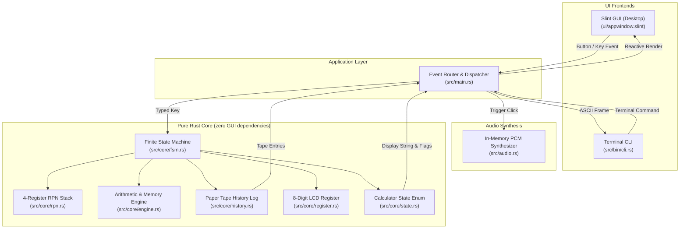

# Heptaseg 📟

[](https://github.com/vikman90/heptaseg/actions/workflows/ci.yml)
[](https://github.com/vikman90/heptaseg/releases)
[](https://opensource.org/licenses/MIT)
[](https://www.rust-lang.org/)
[](https://slint.dev/)

<p align="center">
  
</p>

**Heptaseg** (*hepta* [seven] + *seg* [segments]) is a vintage 8-digit pocket calculator application engineered in **Rust** and rendered with **Slint**. 

It is designed as a study in **clean software architecture, deterministic Finite State Machines (FSM), and vector liquid crystal display (LCD) synthesis**. The core domain is 100% decoupled from the user interface, powering both a native desktop app with tactile audio feedback and an interactive terminal CLI.

---

## ✨ Features

- **Authentic Retro LCD & Multi-Theme Display**:
  - 8 right-aligned 7-segment digit cells with decimal points and ambient ghost segments.
  - **4 Vintage Display Palettes**:
    - **Classic LCD**: Retro olive green background with liquid crystal charcoal ink.
    - **Quartz LCD**: Silver-grey quartz glass with deep carbon black ink.
    - **VFD Cyan**: Glowing vacuum fluorescent display with radiant cyan-turquoise segments.
    - **Ruby LED**: 1976 Sinclair Sovereign style deep ruby display with glowing red LED segments.
  - Annunciator indicators: Memory Active (`M`), Negative Sign (`−`), Error/Overflow (`E`), RPN Mode (`RPN`), and pending operators (`+`, `−`, `×`, `÷`).
- **Standard & HP-Style RPN Modes**:
  - **Standard Pocket Calculator Model**: Immediate execution chaining (`2 + 3 × 4 = 20`) and repeat equals (`5 + 3 = 8 = 11 = 14`).
  - **HP-Style 4-Register RPN Stack**: Classic 4-level operational stack ($X, Y, Z, T$) with stack drop and cascade evaluation (`3 Enter 4 + = 7`).
- **🖨️ Continuous Paper Tape History**:
  - Slide-out retro thermal paper roll tracking all calculations and intermediate results in real time.
- **🔊 Tactile Audio Synthesis**:
  - In-memory synthesized mechanical keycap bottom-out click sound (zero external audio file dependencies, with instant mute toggle).
- **Comprehensive Arithmetic & Memory**:
  - Four basic operations (`+`, `−`, `×`, `÷`), Square Root (`√`), Percentage (`%`), Sign Inversion (`±`).
  - 4-key dedicated memory bank (`M+`, `M−`, `MR`, `MC`).
- **Dual Frontends (Desktop GUI & Terminal CLI)**:
  - **Desktop GUI**: Native Slint binary compiling across **Linux**, **macOS**, and **Windows** (~15 MB RAM).
  - **Terminal CLI**: Terminal interface with an ASCII 7-segment display (`cargo run --bin cli`).
- **Formal Verification & Property-Based Testing**:
  - 41 automated unit, integration, and fuzzing tests via `proptest`.

---

## ⌨️ Keyboard Shortcuts (Desktop GUI)

| Key | Calculator Action | Description |
| :--- | :--- | :--- |
| `0` – `9` | Digits `0`–`9` | Enter numerical digits |
| `.` or `,` | Decimal Point `•` | Append decimal separator |
| `+`, `-`, `*`, `/` | Operations `+`, `−`, `×`, `÷` | Set or chain binary operator |
| `Enter` or `=` | Equals `=` / `Enter` | Evaluate calculation or push RPN stack |
| `%` | Percentage `%` | Compute percentage |
| `t` / `T` | Paper Tape `[TAPE]` | Toggle continuous paper tape receipt drawer |
| `m` / `M` | Theme `[THEME]` | Cycle display palette (Olive, Quartz, VFD, Ruby) |
| `s` / `S` | Sound `[🔊 / 🔇]` | Toggle tactile key click audio feedback |
| `r` / `R` | Mode `[RPN]` | Toggle between Standard and RPN stack modes |
| `Escape` or `c` / `C` | All Clear `AC` | Reset state machine and display |
| `Backspace` or `Delete` | Clear Entry `CE` | Clear currently typed number |

---

## 🏗️ Architecture Overview

Heptaseg follows a unidirectional, decoupled **Model-View-Update (MVI)** design:



For deeper architectural details, state transition tables, and design patterns, see [`ARCHITECTURE.md`](ARCHITECTURE.md).

---

## 🚀 Building and Running

### Prerequisites
- **Rust toolchain** (1.70 or newer recommended): [rustup.rs](https://rustup.rs/)

### Run Graphical Desktop Application
```bash
cargo run --release
```

### Run Terminal CLI Mode
```bash
cargo run --bin cli
```

### Run Comprehensive Test Suite
```bash
# Runs all 17 unit tests, 15 integration tests, 4 history tests, 4 RPN tests, and proptest fuzzing suites
cargo test --all-targets
```

### Run Linter & Formatter Checks
```bash
cargo clippy --all-targets -- -D warnings
cargo fmt --check
```

---

## 📁 Repository Structure

```
heptaseg/
├── .github/
│   └── workflows/
│       ├── ci.yml           # Multi-platform CI (Linux, macOS, Windows)
│       └── release.yml      # Automated release binary packager
├── Cargo.toml               # Package configuration & dependencies
├── build.rs                 # Slint template build compilation
├── LICENSE                  # MIT License
├── README.md                # Project documentation
├── ARCHITECTURE.md          # In-depth architectural specification
├── ui/
│   ├── appwindow.slint      # Main calculator casing, header, and controls
│   ├── lcd_display.slint    # 8-digit LCD bezel, grid & annunciators
│   ├── lcd_digit.slint      # Vector-rendered 7-segment + DP digit cell
│   ├── keypad.slint         # Tactile 3D beveled buttons and keypad grid
│   └── paper_tape.slint     # Expandable receipt paper tape history drawer
├── src/
│   ├── main.rs              # Desktop GUI entry point & Slint synchronization
│   ├── lib.rs               # Library root re-exporting core modules
│   ├── audio.rs             # In-memory PCM mechanical click sound synthesizer
│   ├── bin/
│   │   └── cli.rs           # Terminal CLI binary with ASCII 7-segment display
│   └── core/
│       ├── mod.rs           # Core module definitions
│       ├── types.rs         # Domain types (Key, BinaryOp, UnaryOp, MemoryOp, Flags, Themes)
│       ├── register.rs      # 8-digit numeric buffer & LCD formatting
│       ├── engine.rs        # Arithmetic calculations & memory bank
│       ├── history.rs       # Paper tape calculation history log
│       ├── rpn.rs           # 4-level HP-style RPN stack engine
│       ├── state.rs         # Calculator state enum definitions
│       └── fsm.rs           # Pure Finite State Machine transition handler
└── tests/
    ├── fsm_tests.rs         # Deterministic integration test suite
    ├── history_tests.rs     # Paper tape history integration tests
    ├── rpn_tests.rs         # HP-style RPN stack integration tests
    └── proptest_fsm.rs      # Property-based testing & fuzzing invariants
```

---

## 📜 License

Distributed under the **MIT License**. See [`LICENSE`](LICENSE) for details.
