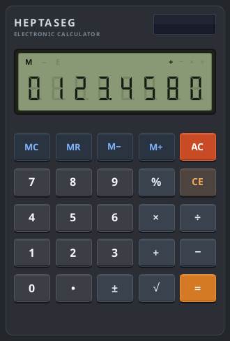
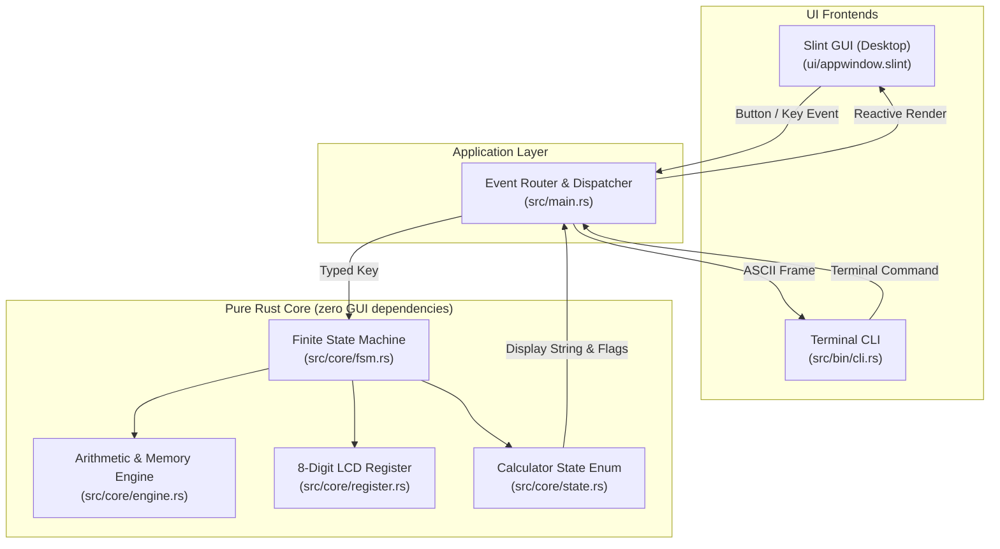

# Heptaseg 📟

[](https://github.com/vikman90/heptaseg/actions/workflows/ci.yml)
[](https://opensource.org/licenses/MIT)

[](https://www.rust-lang.org/)
[](https://slint.dev/)

<p align="center">
  
</p>

**Heptaseg** (*hepta* [seven] + *seg* [segments]) is a vintage 8-digit pocket calculator application engineered in **Rust** and rendered with **Slint**. 

It is designed as a study in **clean software architecture, deterministic Finite State Machines (FSM), and vector liquid crystal display (LCD) synthesis**. The core domain is 100% decoupled from the user interface, allowing the same state machine to power both the native graphical desktop app and a retro terminal CLI.

---

## ✨ Features

- **Authentic Retro LCD Display**:
  - 8 right-aligned 7-segment digit cells with decimal points.
  - Pixel-perfect orthogonal vector polygons with realistic inactive/ghost segment coloring under ambient contrast.
  - Annunciator indicators: Memory Active (`M`), Negative Sign (`−`), Error/Overflow (`E`), and active pending operator (`+`, `−`, `×`, `÷`).
- **Standard Pocket Calculator Model**:
  - Immediate execution chaining (`2 + 3 × 4 = 20`).
  - Repeat calculation on consecutive `=` keypresses (`5 + 3 = 8 = 11 = 14`).
  - Operator replacement (`10 + × 2 = 20`).
- **Comprehensive Arithmetic & Functions**:
  - Four basic operations (`+`, `−`, `×`, `÷`).
  - Unary functions: Square Root (`√`), Percentage (`%`), Sign Inversion (`±`).
  - Dedicated 4-key memory bank: `M+`, `M−`, `MR`, `MC`.
  - Clear entry (`CE`) and All Clear (`AC`).
- **Dual Frontends (GUI & CLI)**:
  - **Desktop GUI**: Native Slint application compiling to a single lightweight binary on **Linux**, **macOS**, and **Windows** (~15 MB RAM).
  - **Terminal CLI**: Terminal interface rendering an ASCII 7-segment LCD directly in stdout.
- **Formal Verification & Property-Based Testing**:
  - Invariants validated over thousands of randomized keystroke sequences using `proptest`.

---

## ⌨️ Keyboard Shortcuts (Desktop GUI)

| Key | Calculator Action | Description |
| :--- | :--- | :--- |
| `0` – `9` | Digits `0`–`9` | Enter numerical digits |
| `.` or `,` | Decimal Point `•` | Append decimal separator |
| `+`, `-`, `*`, `/` | Operations `+`, `−`, `×`, `÷` | Set or chain binary operator |
| `Enter` or `=` | Equals `=` | Evaluate calculation / repeat |
| `%` | Percentage `%` | Compute percentage |
| `Escape` or `c` / `C` | All Clear `AC` | Reset state machine and display |
| `Backspace` or `Delete` | Clear Entry `CE` | Clear currently typed number |

---

## 🏗️ Architecture Overview

Heptaseg follows a unidirectional, decoupled **Model-View-Update (MVI)** design:



For deeper architectural details, state transition tables, and design patterns, see [`ARCHITECTURE.md`](ARCHITECTURE.md).

---

## 🚀 Building and Running

### Prerequisites
- **Rust toolchain** (1.70 or newer recommended): [rustup.rs](https://rustup.rs/)

### Run Graphical Desktop Application
```bash
cargo run --release
```

### Run Terminal CLI Mode
```bash
cargo run --bin cli
```

### Run Comprehensive Test Suite
```bash
# Runs all 13 unit tests, 15 integration tests, and proptest fuzzing suites
cargo test --all-targets
```

### Run Linter & Formatter Checks
```bash
cargo clippy --all-targets -- -D warnings
cargo fmt --check
```

---

## 📁 Repository Structure

```
heptaseg/
├── .github/
│   └── workflows/
│       └── ci.yml           # Multi-platform CI (Linux, macOS, Windows)
├── Cargo.toml               # Package configuration & Slint dependencies
├── build.rs                 # Slint template build compilation
├── LICENSE                  # MIT License
├── README.md                # Project documentation
├── ARCHITECTURE.md          # In-depth architectural specification
├── ui/
│   ├── appwindow.slint      # Main calculator casing, header, and solar panel
│   ├── lcd_display.slint    # 8-digit LCD bezel, grid & annunciators
│   ├── lcd_digit.slint      # Vector-rendered 7-segment + DP digit cell
│   └── keypad.slint         # Tactile 3D beveled buttons and keypad grid
├── src/
│   ├── main.rs              # Desktop GUI entry point & Slint synchronization
│   ├── lib.rs               # Library root re-exporting core modules
│   ├── bin/
│   │   └── cli.rs           # Terminal CLI binary with ASCII 7-segment display
│   └── core/
│       ├── mod.rs           # Core module definitions
│       ├── types.rs         # Domain types (Key, BinaryOp, UnaryOp, MemoryOp, Flags)
│       ├── register.rs      # 8-digit numeric buffer & LCD formatting
│       ├── engine.rs        # Arithmetic calculations & memory bank
│       ├── state.rs         # Calculator state enum definitions
│       └── fsm.rs           # Pure Finite State Machine transition handler
└── tests/
    ├── fsm_tests.rs         # Deterministic integration test suite
    └── proptest_fsm.rs      # Property-based testing & fuzzing invariants
```

---

## 📜 License

Distributed under the **MIT License**. See [`LICENSE`](LICENSE) for details.
